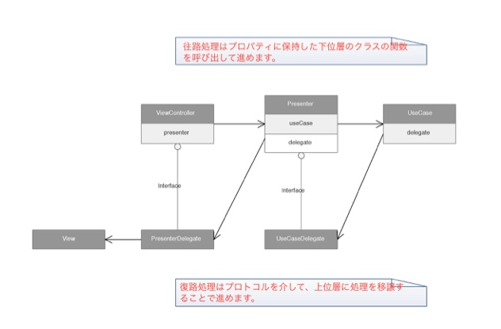

# Clean Architectureのサンプルアプリ

Clean Architectureの勉強のために作成したサンプルアプリです。

## Getting Started

### 環境構築

下記を参考に環境構築を行ってください。

http://tenten0213.hatenablog.com/entry/2016/10/31/122602

### 必要なツールをインストールします

```
cd CleanSample
bundle install --path vendor/bundle
```

### 依存ライブラリを取得します
```
bundle exec pod install
```

## ポイント

### 疎結合
UI層とDomain層の接合部分をdelegateで作り、疎結合になるように設計しました。



### 一つのプレゼンターで複数のユースケースを実行できる

* ViewControllerとPresenterは一対で作成します。
* 一つのPresenterから複数のUseCaseを使用できます。
* 一つのUseCaseを複数のPresenterで使用することも可能です。

### UseCase側の処理の進み具合に合わせて画面を更新できる

UseCase側の処理の進み具合に合わせて画面を更新できるように、一つのUseCaseに対して複数の出力用delegate関数を用意しました。
そうすることで、VCでは以下のような処理を別々の関数として作成できます。

1. 【実行中】業務ロジックの中でネットワーク通信が始まった場合、通知バーにインジケータを表示する
1. 【異常終了】エラーが発生した場合は画面にメッセージを表示する
1. 【正常終了】取得したデータを画面に描画する
